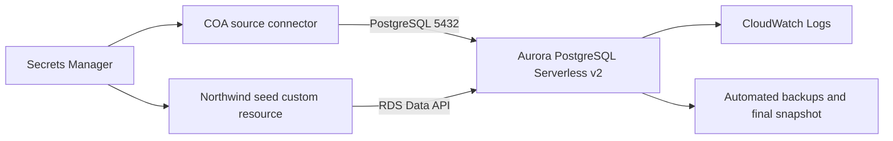

# Northwind Auroraデモ環境の設計

## 方針

Northwind用のAuroraリソースは既存COA CDKアプリに独立したサービススタックとして追加する。スタックは既存のNetworkStackを参照し、同じVPCのprivate subnetにAurora PostgreSQL Serverless v2を配置する。データ投入にはRDS Data APIを使うLambda-backed custom resourceを採用する。seed LambdaをVPCへ配置する必要がなくなり、データベースをpublicにせず初期化できる。

Aurora Express configurationは使わない。COAのGlue connectionとconnector Lambdaから到達できるcustomer VPC、subnet group、security groupが必要だからである。

## アーキテクチャ

## CDK構成

`NorthwindDemoStack`を追加し、NetworkStackをpropsで受け取る。スタックはDB subnet group、Aurora cluster、Serverless v2 writer、接続用security group、生成資格情報のSecret、seed custom resourceを所有する。security groupはNetworkStackのconnector security groupからのTCP 5432だけを受け入れる。クラスターとインスタンスはprivate subnetに置き、publicly accessibleを無効にする。

クラスターではAurora PostgreSQL 17.10を使い、AWS管理キーによるストレージ暗号化、IAMデータベース認証、Data API、Performance Insights、PostgreSQLログ出力を有効にする。バックアップは7日保持し、削除保護を有効にする。CloudFormationのremoval policyはsnapshotとする。意図的に廃止するときは削除保護を別の変更で解除してからstackを削除し、最終スナップショットを残す。Serverless v2は最小0 ACU、最大2 ACU、自動停止まで300秒とする。CPUUtilizationとDatabaseConnectionsの実測値を集めた後、必要に応じて上限を調整する。

## データモデルと生成量

標準Northwindの業務概念と外部キー構造を維持する。主要エンティティはcategories、customers、employees、orders、order_details、products、shippers、suppliersである。employeeの上司関係、productとsupplier/categoryの関係、orderとcustomer/employee/shipperの関係、order_detailsの多対多解消を保持する。

標準データを投入した後、顧客500件、商品100件、注文5,000件、注文明細約15,000件になるまで合成データを追加する。注文日は3年間に分散させる。乱数seedを固定し、同じ入力から同じデータを生成する。注文合計、値引き、配送遅延、商品カテゴリ、担当社員、地域別売上を検証できるよう、値の分布に偏りを持たせる。初期規模はCOAの全機能を試すには十分だが、Auroraの性能試験を目的としない。Northwind由来のSQLと標準データにはライセンスと出典を同梱する。

## seed処理

Python 3.12のseed LambdaはSQLスキーマのバージョンと生成設定のハッシュをcustom resource propertyとして受け取る。専用のseed_metadataテーブルに適用済みハッシュを記録し、同じハッシュなら処理を省略する。新規環境ではDDL、固定マスターデータ、合成トランザクションデータの順に適用する。途中で失敗した場合はトランザクションをロールバックし、CloudFormationへ失敗理由を返す。

大量のSQLを1回のData API呼び出しへ詰め込まない。DDLとデータを依存順に分割し、Data APIの制限内でbatch実行する。資格情報はログへ出さない。seed Lambdaには対象clusterのData API実行、対象Secretの読み取り、ログ出力に必要な権限だけを付与する。

## COAへの接続

CloudFormation outputとしてcluster endpoint、port、database名、Secret ARNを返す。COAではJDBC_DATABASE、POSTGRESQL、port 5432を選び、出力されたSecret ARNを指定する。Aurora側のsecurity groupはconnector security groupだけを許可するため、ローカル端末からの直接接続は前提にしない。

## テストと完了条件

CDKテストでは生成テンプレートのRDS、Secrets Manager、IAM、security group、backup、deletion protectionを検証する。seedロジックのテストでは固定seedによる再現性、外部キー整合性、期待行数、再実行時の非重複を確認する。デプロイ後はData APIで行数、顧客別売上、商品カテゴリ別売上、配送遅延のjoin queryを実行する。最後にCOAへ登録し、スキャン完了と主要テーブルの検出を確認する。

## 障害時の扱い

クラスター作成が失敗した場合はCloudFormationイベントを確認し、部分的な手動作成は行わない。seedだけが失敗した場合はclusterを保持し、custom resourceのログとseed_metadataを確認して再デプロイする。COA接続が失敗した場合はSecretの形式、connector security group、database名、Aurora endpointの順に確認する。
