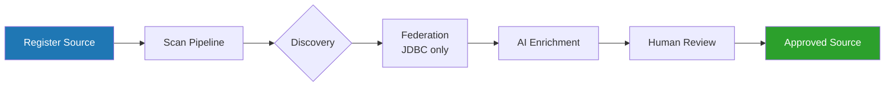
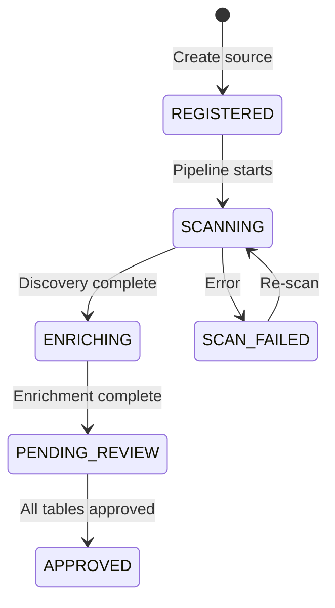

# Structured Data Source Guide

This guide covers how to register, scan, review, and manage structured (database) data sources in Context Ontology Accelerator.

!!! tip "Full request/response schemas"
    This guide shows the workflow, field reference, and key behaviors for
    sources. For the complete request/response schema, every field, and status
    codes for each endpoint, see the **[API Reference](#/api-reference)**
    (Control Plane API → Unified sources) — it's generated directly from the
    API contract and always current.

## Overview

Structured data sources connect your relational databases to Context Ontology Accelerator. Once connected, the platform:

1. **Discovers** tables, columns, and constraints from your database catalog
2. **Provisions** an Athena federated catalog so your data is queryable (JDBC sources)
3. **Enriches** metadata with AI-generated descriptions, synonyms, and key inference
4. **Presents** the enriched metadata for human review before it enters the knowledge graph



## Supported Source Types

| Type | Sub-type | Engine | How it's queried |
|------|----------|--------|-----------------|
| Glue Data Catalog | `GLUE_DATABASE` | Any Glue-registered database | *Athena (native)* - must be already queryable in athena at onboard time |
| JDBC | `JDBC_DATABASE` | PostgreSQL | Direct SQL or Athena federated |
| JDBC | `JDBC_DATABASE` | Redshift | Direct SQL or Athena federated |
| JDBC | `JDBC_DATABASE` | MySQL | Direct SQL or Athena federated |
| JDBC | `JDBC_DATABASE` | SQL Server | Direct SQL or Athena federated |
| JDBC | `JDBC_DATABASE` | Oracle | Athena federated only |
| JDBC | `JDBC_DATABASE` | Snowflake | Athena federated only |

### Direct SQL vs Athena federated

For JDBC sources, the serve layer picks the query path automatically — you don't
configure it:

- **Direct SQL** — a **single-source** query runs straight against the database over
  its native driver (PostgreSQL/Redshift via asyncpg, MySQL via aiomysql, SQL Server
  via python-tds). This is the low-latency path (roughly 20–50 ms vs ~500–800 ms for
  federation) and is used whenever every table in the query belongs to one direct-SQL
  capable source. The source's `queryEngine` is set to `JDBC` at onboarding for these
  engines.
- **Athena federated** — **cross-source** queries (joining tables from more than one
  source) run through the Athena federated catalog provisioned at onboarding. This is
  always the fallback, so a query that can't take the direct path still resolves.

Both paths are read-only and go through the same SQL firewall. `queryEngine` is a
system-set, read-only field — there is no API or configuration knob for it.

!!! note "Oracle and Snowflake are federation-only"
    Oracle and Snowflake have no direct-SQL driver on the serve path, so every
    query against them — single-source or cross-source — runs through the Athena
    federated catalog. Their `queryEngine` is always `ATHENA` (never `JDBC`), which
    means they always require the federated catalog provisioned at onboarding and
    do not benefit from the low-latency direct-SQL path.

## Registering a JDBC Data Source

### Prerequisites

1. **Credentials in Secrets Manager** — Create a secret with `username` and `password` keys:

```bash
aws secretsmanager create-secret \
  --name "coa/jdbc/my-postgres" \
  --secret-string '{"username":"readonly_user","password":"s3cur3!"}'
```

2. **Network access** — The source database must be reachable from the COA VPC. The connector security group needs inbound access on your database port:

| Engine | Default Port |
|--------|-------------|
| PostgreSQL | 5432 |
| Redshift | 5439 |
| MySQL | 3306 |
| SQL Server | 1433 |
| Oracle | 1521 |
| Snowflake | 443 (HTTPS) |

!!! note "Snowflake is a SaaS endpoint, not a private database"
    Snowflake is reached over the public internet on **port 443**, not on a
    private VPC/RDS endpoint like the other engines. The connector security group
    therefore allows egress on 443 (Snowflake wire protocol) **and port 80**, which
    `snowflake-connector-python` uses for OCSP certificate-revocation checks — OCSP
    is an HTTP-only protocol with no HTTPS variant, and the responses are
    cryptographically signed. Both rules are egress-only. Deployments that onboard
    no Snowflake source can drop the port-80 rule with the
    `connector_ocsp_egress=false` CDK context key, and all connector egress can be
    narrowed from `0.0.0.0/0` to fixed CIDRs with `connector_egress_cidrs`. See the
    internal egress-controls reference for details.

3. **Database user permissions** — The credential user needs `SELECT` on `information_schema` (or equivalent catalog views) for schema discovery.

!!! tip "Cross-account databases"
    If the database, its credential secret, or its VPC live in a different
    account, see [Cross-Account Data Sources](cross-account-sources.md) for
    secret sharing, cross-account roles, and network setup.

### Optional Northwind Aurora demo

Deploy the private Aurora PostgreSQL demo database with:

```bash
make deploy-northwind-demo
```

This deploys `coa-dev-northwind-demo`. Register a source with `sourceType` set to `DATABASE` and `engine` set to `POSTGRESQL`, using these stack outputs:

| CloudFormation output | Database source field |
|---|---|
| `NorthwindClusterEndpoint` | `host` |
| `NorthwindDatabaseName` | `databaseName` |
| `NorthwindPort` | `port` |
| `NorthwindSecretArn` | `credentialSecretArn` |

The database is private. Before registration, ensure the COA VPC connector security group can reach the Aurora security group; local direct connections are not supported. The stack output provides the Secret ARN only and never exposes credentials.

### Register via API

Create via `POST /namespaces/{namespaceId}/sources` with `sourceType: "DATABASE"`
and a `databaseSource.jdbcConfiguration` body — see **CreateSource** in the
[API Reference](#/api-reference) for the full request schema and response.

### Register via Web UI

1. Navigate to **Sources** within your namespace
2. Click **Connect source**
3. Select **JDBC Database**
4. Fill in connection details (host, port, database, engine)
5. Provide the Secrets Manager ARN for credentials
6. Optionally configure schema/table filters
7. Click **Connect**

### JDBC Configuration Fields

| Field | Required | Description |
|-------|----------|-------------|
| `engine` | Yes | `POSTGRESQL`, `REDSHIFT`, `MYSQL`, `SQLSERVER`, `ORACLE`, `SNOWFLAKE` |
| `host` | Yes | Database hostname (RFC 1123, max 253 chars). For Snowflake, the account host `<account>.snowflakecomputing.com` |
| `port` | Yes | Port number (1–65535). Snowflake uses `443` |
| `databaseName` | Yes | Target database (alphanumeric + `_` `-`, max 128 chars) |
| `credentialSecretArn` | Yes | Secrets Manager secret ARN with `username`/`password` |
| `crossAccountRoleArn` | No | IAM role to assume for cross-account secret access. The web app's **Connect Source** form requires the role name to contain `{prefix}-datasource-access-` as a convention |
| `schemaFilter` | No | Regex — only schemas matching this pattern are discovered |
| `schemaExcludeFilter` | No | Regex — schemas matching this are excluded (after include filter) |
| `tableFilter` | No | Regex — only tables matching this are discovered |
| `tableExcludeFilter` | No | Regex — tables matching this are excluded |
| `warehouse` | Snowflake only | Virtual warehouse used to run `INFORMATION_SCHEMA` discovery queries and required by federation. **Required for Snowflake** — omitting it fails the scan (`SCAN_FAILED`) at federation time |
| `role` | No (Snowflake only) | Optional Snowflake RBAC role name for the discovery session — a Snowflake construct, **not** an AWS IAM role. Honored during discovery only; federation runs as the secret user's `DEFAULT_ROLE`, so grant that role least-privilege read access |
| `metadataEnrichmentEnabled` | No | `true` (default) or `false` — skip AI enrichment |

!!! warning "Snowflake requires a warehouse and relies on the user's DEFAULT_ROLE"
    Snowflake cannot execute queries without an active warehouse, and the managed
    Glue federated connector enforces this at connection-creation time — so
    `warehouse` is mandatory for Snowflake sources. The Glue connector also rejects
    a per-connection `role`, so federation always runs as the credential user's
    Snowflake `DEFAULT_ROLE`. Create that user with
    `DEFAULT_ROLE = <least-privilege read-only role>` so both discovery and
    federated queries stay scoped.

### Input Validation

Host, port, and database name are validated to prevent JDBC parameter injection:

- **host** — alphanumeric + `.` `-` `_`, max 253 chars
- **port** — integer 1–65535
- **database** — alphanumeric + `_` `-`, max 128 chars

## Registering a Glue Data Catalog Source

### Prerequisites

- The Glue database must exist in the same or a cross-account Data Catalog
- The COA deployment role needs `glue:GetDatabase`, `glue:GetTables`, `glue:GetTable` permissions

!!! tip "Cross-account catalogs"
    For a Glue catalog in a different account — or a Lake Formation–governed
    catalog — see [Cross-Account Data Sources](cross-account-sources.md) for the
    required resource policies and Lake Formation grants.

### Register via API

Create via `POST /namespaces/{namespaceId}/sources` with `sourceType: "DATABASE"`
and a `databaseSource.glueConfiguration` body — see **CreateSource** in the
[API Reference](#/api-reference) for the full request schema and response.

### Glue Configuration Fields

| Field | Required | Description |
|-------|----------|-------------|
| `catalogId` | **Yes** | Glue Data Catalog ID: a 12-digit AWS account ID (root catalog), or `account:catalogName` for nested/federated/cross-account catalogs. Pattern-validated (`^\d{12}(:[a-zA-Z0-9_/-]+)?$`), 12–256 chars |
| `region` | **Yes** | AWS region the catalog/database lives in |
| `databaseName` | Yes | Glue database name |
| `tableFilter` | No | Regex — only tables matching this are discovered |
| `tableExcludeFilter` | No | Regex — tables matching this are excluded |
| `crossAccountRoleArn` | No | IAM role ARN the discovery connector assumes to read catalog metadata in a different account. The web app's **Connect Source** form requires the role name to contain `{prefix}-datasource-access-` as a convention |
| `externalId` | No | STS ExternalId required by the cross-account role's trust policy — only meaningful alongside `crossAccountRoleArn` |
| `athenaDataCatalogName` | No | Explicit Athena catalog name (overrides auto-resolution) |

## Monitoring Scans

After registering a source, a scan pipeline runs automatically. Monitor its progress:

### Source Status Lifecycle



### Poll Source Status

Poll `GET /namespaces/{namespaceId}/sources/{sourceId}` and check the `status`
field. Scan job detail (including the `errorMessage` field on failure) is
available via `GET .../sources/{sourceId}/scan/{jobId}` — see
**GetSource** / **GetSourceScanJob** in the [API Reference](#/api-reference).

### Interpreting Errors

| Status | Meaning | Action |
|--------|---------|--------|
| `SCAN_FAILED` | Discovery or federation failed | Check source credentials and network connectivity; re-scan |
| `ENRICHING` stuck | Bedrock throttling or timeout | Wait and retry; check CloudWatch for `BedrockThrottleCount` metric |
| Federation error with "Insufficient Lake Formation permission" | Provisioner role is not an LF data-lake admin | See [Lake Formation bootstrap](../getting-started.md) |

When a scan fails, the scan history in the web UI now surfaces the **actual
error message** captured from the failed scan job (the `errorMessage` field
returned by the scan-job endpoint above). This makes it easier to diagnose connection failures,
permission issues, and other scan problems directly from the UI. The same `errorMessage` is available programmatically on
the `GET .../scan/{jobId}` response.

### Skipping AI Enrichment

If you don't need AI-generated metadata and want faster scans, disable enrichment at creation:

```json
{ "metadataEnrichmentEnabled": false }
```

The source transitions `SCANNING → PENDING_REVIEW` directly, skipping the `ENRICHING` phase. You can toggle `metadataEnrichmentEnabled` later (see "Updating Source-Level Metadata" below); re-running enrichment on an already-scanned source is part of the planned schema-drift re-scan enhancement (see "Triggering Re-scans" below).

## Reviewing Enriched Metadata

After a scan completes, the source enters `PENDING_REVIEW`. Review the discovered tables and columns before they become queryable.

### Filtering Tables by Review Status

The source detail page in the web UI includes a status dropdown above the
tables list that filters by review status: **All statuses**, **Pending
review**, **Approved**, and **Rejected**. On large sources this lets you focus
on the tables that still need attention (`Pending review`) without scrolling
past already-reviewed tables. The filter maps to the `reviewStatus` query
parameter on **ListSourceTables** in the [API Reference](#/api-reference).

### List and Get Table Detail

List all tables via `GET .../sources/{sourceId}/tables`, or get a single
table's full detail (technical + AI-enriched metadata, `reviewStatus`,
`enrichmentSource`) via `GET .../tables/{tableId}` — see **ListSourceTables**
/ **GetSourceTable** in the [API Reference](#/api-reference).

### Approve or Reject a Single Table

`PUT .../tables/{tableId}/review` with `{ "decision": "APPROVED" }` or
`{ "decision": "REJECTED" }` — see **ReviewSourceTable** in the
[API Reference](#/api-reference) for the full request/response shape.

**Cascade behavior:**
- **Approving** a table cascades to its `PENDING_REVIEW` columns. Columns you've explicitly `REJECTED` are preserved — they won't be flipped by a table-level approve.
- **Rejecting** a table cascades to ALL non-rejected columns (including previously approved ones).

### Approve/Reject a Column

The same `{ "decision": ... }` body applies at the column level via
`PUT .../tables/{tableId}/columns/{columnName}/review` — see
**ReviewSourceColumn** in the [API Reference](#/api-reference).

### Bulk Approve/Reject All (Async)

For sources with many tables, `POST .../sources/{sourceId}/approve` or
`.../reject` bulk-processes all tables. Both return `202 Accepted` (see
**ApproveSource** / **RejectSource** in the [API Reference](#/api-reference)):

- **Approve:** the source enters `APPROVING` status while a background worker processes all tables. Poll the source status until it reaches `APPROVED`. Only `PENDING_REVIEW` tables and columns are touched — anything already explicitly approved or rejected is preserved.
- **Reject:** after completion, the source returns to `PENDING_REVIEW` (not `APPROVED`), allowing further review.

## Editing Metadata as a Steward

Stewards can edit AI-generated metadata to correct descriptions, add context, or fix key relationships.

### Edit Table or Column Metadata

`PATCH .../tables/{tableId}/metadata` with an `{ "overrides": {...} }` body
(`description`, `synonyms`, `glossaryTerms`, `tags`) edits table-level
metadata. The same shape applies at the column level via
`PATCH .../tables/{tableId}/columns/{columnName}/metadata` (typically just
`description`). See **UpdateSourceTableMetadata** / **UpdateSourceColumnMetadata**
in the [API Reference](#/api-reference) for all overridable fields.

### Edit Primary & Foreign Keys

`PATCH .../tables/{tableId}/keys` with `primaryKey`/`foreignKeys` fields — see
**UpdateSourceTableKeys** in the [API Reference](#/api-reference) for the
full request schema.

- Omitting a field leaves it unchanged; an empty list clears it
- Column names are validated against the table's actual columns
- Steward-specified keys are tagged `STEWARD_SPECIFIED` and override AI-inferred keys

### Metadata Priority Hierarchy

Edits follow a priority system. Higher-priority sources are never overwritten by lower-priority ones:

| Priority | Source | Survives re-scan? |
|----------|--------|-------------------|
| 1 (highest) | `STEWARD_EDITED` / `STEWARD_SPECIFIED` | ✅ Always preserved |
| 2 | `DETERMINISTIC` (from DB constraints) | ✅ Re-discovered |
| 3 (lowest) | `AI_GENERATED` | Re-generated (may change) |

!!! note
    Editing metadata does NOT change the review status. To approve after editing, make a separate `PUT /review` call. This is intentional — the "edit + approve" UX is two distinct actions.

## Triggering Re-scans

!!! note
    For structured (database) sources, re-scan is a **recovery action only** — it
    is permitted **only when the source is in `SCAN_FAILED` status**. Re-scanning
    an already-scanned source to pick up schema changes (DDL drift) is a **planned
    enhancement for a future phase** and is not yet supported. Calling re-scan on a
    database source in any other status returns a `409 Conflict`
    (`Re-scan is only allowed when status is 'SCAN_FAILED'`).

Re-scan a failed source to retry the scan pipeline after correcting the
underlying problem (for example, fixed credentials, restored network
connectivity, or granted Lake Formation permissions) via
`POST .../sources/{sourceId}/rescan` — see **RescanSource** in the
[API Reference](#/api-reference).

### When to Re-scan

- After a scan fails (`SCAN_FAILED`) and you have corrected the cause — bad
  credentials, an unreachable host, or missing Lake Formation permissions

### What Happens on Re-scan

1. The source transitions `SCAN_FAILED → SCANNING` and the scan pipeline restarts
2. Discovery, federation (JDBC only), and AI enrichment run again
3. Steward edits are preserved (see the metadata priority hierarchy above)

!!! info "Coming in a future phase"
    Schema-drift re-scans of healthy or approved sources — discovering new
    tables/columns, cleaning up removed objects, and re-enriching with change
    detection — are a planned enhancement and not yet available.

## Updating Source-Level Metadata

Update the source's name, description, or toggle enrichment via
`PUT .../sources/{sourceId}/metadata` — see **UpdateSourceMetadata** in the
[API Reference](#/api-reference).

## Deleting a Data Source

`DELETE /namespaces/{namespaceId}/sources/{sourceId}` — see **DeleteSource**
in the [API Reference](#/api-reference).

### What Gets Removed

| Resource | Cleanup |
|----------|---------|
| DynamoDB source record | Deleted |
| DynamoDB scan job records | Deleted |
| DataZone assets (tables) | Deleted |
| Glue Connection (JDBC) | Deleted |
| Glue Federated Catalog (JDBC) | Deleted |
| Lake Formation registration (JDBC) | Deregistered |
| Namespace source counter | Decremented |

!!! warning
    JDBC source deletion requires the federation provisioner role to have Lake Formation data-lake admin privileges. If teardown fails, the delete returns `500` and the source remains — retry once the prerequisite is met.

## Querying via Athena

Once a source is scanned and approved, it's queryable via Amazon Athena using the namespace's dedicated workgroup.

### JDBC Sources (4-part naming)

```sql
SELECT *
FROM "AwsDataCatalog"."coa-dev-ds_a1b2c3d4"."public"."orders"
LIMIT 100;
```

The catalog and connection names are available on the source detail
(`GET /namespaces/{namespaceId}/sources/{sourceId}` →
`databaseDetails.athenaDataCatalogName`) — see **GetSource** in the
[API Reference](#/api-reference).

### Glue Sources (3-part naming)

```sql
SELECT *
FROM "my_data_lake"."orders"
LIMIT 100;
```

## Authorization

| Action | Required Role |
|--------|--------------|
| List sources | Any namespace role (`viewNamespace`) |
| Create source | `namespace-owner`, `data-steward`, or `platform-admin` |
| View source/tables | Any namespace role (`viewNamespace`) |
| Review/edit metadata | `namespace-owner`, `data-steward`, or `platform-admin` |
| Delete source | `namespace-owner`, `data-steward`, or `platform-admin` |
| Re-scan | `namespace-owner`, `data-steward`, or `platform-admin` |

## Troubleshooting

| Symptom | Cause | Fix |
|---------|-------|-----|
| `SCAN_FAILED` immediately | Bad credentials or host unreachable | Verify secret has `username`/`password`; check SG allows inbound from connector SG |
| Discovery succeeds, enrichment fails | Bedrock access not granted or throttled | Verify Bedrock model access; check `BedrockThrottleCount` metric |
| Athena query: "Catalog not found" | Source hasn't been scanned, or federation step failed | Re-scan; check pipeline logs |
| Athena query: connection timeout | Source DB security group blocks connector SG | Add inbound rule from connector SG on the DB port |
| `409` on review/edit | Source is in a transient state (`SCANNING`, `APPROVING`) | Wait for pipeline to complete |
| Bulk approve stuck in `APPROVING` | Worker Lambda timed out | Check worker CloudWatch logs; retry the POST |
| Delete returns 500 | Federation teardown failed (LF admin missing) | Register the provisioner role as LF admin; retry |
| `Unsupported database engine: <ENGINE>` on connect | The `engine` value is not one of the supported engines listed above | Use a supported engine, or register the database through the Glue Data Catalog instead |
| Snowflake `SCAN_FAILED` right after discovery succeeds | No `warehouse` set — federation is rejected at connection creation (`WAREHOUSE are missing in the request object`) | Set `jdbcConfiguration.warehouse` to an active Snowflake virtual warehouse and re-scan |
| Snowflake/Oracle scan succeeds but Athena queries return `TABLE_NOT_FOUND` on an empty catalog | Historical casing-filter bug (fixed) — the federated catalog resolved but exposed zero objects because Snowflake/Oracle fold unquoted identifiers to UPPERCASE | Fixed in current releases (the lowercase casing filter is no longer sent for Oracle/Snowflake). Delete and re-create the source if it was onboarded before the fix — the property is non-updatable |
| `SCAN_FAILED` with `... exceeding the limit of N` | Source has more tables than `MAX_TABLES_PER_SOURCE` (default `10000`); discovery fails fast rather than hitting the Lambda timeout | Narrow the scan scope with `schemaFilter` / `schemaExcludeFilter` / `tableFilter` (e.g. exclude system schemas like `schemaExcludeFilter: "information_schema\|pg_catalog\|sys"`). If a larger source genuinely needs to be scanned in one pass, raise (or set `0` to disable) the `MAX_TABLES_PER_SOURCE` env var on the `sources-db-connector` Lambda. |
| Scan times out on a very large Glue/Athena catalog | Enum sampling issues one Athena query per candidate column; the fan-out has to fit inside the scan Lambda timeout | Sampling queries run in parallel, capped by the `ATHENA_SAMPLING_CONCURRENCY` env var on the `sources-db-connector` Lambda (default `16`). Raise it if the account's Athena concurrent-DML quota allows more in-flight queries — that quota, not this setting, is the real ceiling. A non-numeric value falls back to `16`, and the effective concurrency is floored at `1`. |

## Document Sources

### Local Upload

Upload files directly through the web app:

1. Navigate to your namespace → **Sources** → **Connect Source**
2. Select **Documents** source type
3. Click **Get Upload URLs** to obtain pre-signed S3 URLs
4. Upload files (PDF, TXT, DOCX, HTML — max 50MB per file)
5. Click **Create Source** — files are preprocessed and ingested into the knowledge graph

### Via the API

Creating a document source from local files is a three-call sequence — see
**GetSourceUploadUrls** and **CreateSource** in the
[API Reference](#/api-reference) for the full request/response schemas:

1. `POST /namespaces/{namespaceId}/sources/upload-urls` with the list of
   files (`fileName`, `contentType`) to get back a pre-signed S3 URL per file.
2. `PUT` each file's bytes directly to its pre-signed URL.
3. `POST /namespaces/{namespaceId}/sources` with `sourceType: "DOCUMENTS"` and
   the `s3Prefixes` the files were uploaded under, to create the source and
   kick off ingestion.

### S3 Bucket Source (Same Account)

Create directly via `POST /namespaces/{namespaceId}/sources` with
`sourceType: "DOCUMENTS"` and a `documentSource.sourceBucketArn` +
`s3Prefixes` pointing at an existing bucket — no upload step needed. See
**CreateSource** in the [API Reference](#/api-reference).

### S3 Bucket Source (Cross-Account)

For documents in a different AWS account, add a `roleArn` that Ontology
Accelerator can assume, alongside `sourceBucketArn` and `s3Prefixes` (same
**CreateSource** request, [API Reference](#/api-reference)):

The role must:
- Trust the Context Ontology Accelerator sources Lambda to assume it
- Follow the naming convention: role name must start with `{prefix}-` (e.g. `coa-`)
- Have `s3:GetObject` and `s3:ListBucket` on the source bucket

### Document Processing Pipeline

After creation, documents go through:

1. **Preprocessing** — extracts text, splits into chunks, validates file size
2. **Entity extraction** — identifies concepts and relationships from text
3. **Knowledge graph build** — creates nodes/edges in Neptune
4. **Embedding** — vectorizes chunks for semantic search in OpenSearch

## Cross-Account Sources

For the full step-by-step on cross-account JDBC (network, credentials, secret policies) and cross-account Glue (IAM mode, Lake Formation, RAM sharing, VPC peering), see [Cross-Account Data Sources](cross-account-sources.md).
